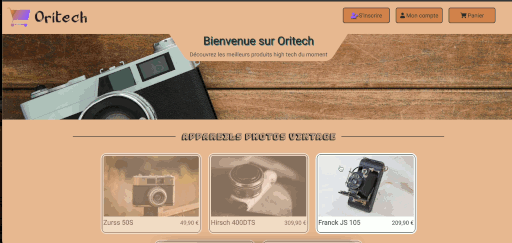

# Orinoco

Projet 5 de la formation Développeur web de chez Openclassrooms.

Pour ce projet il nous est demandé de construire le MVP d'un site e-commerce en utilisant JavaScript
pour convaincre de futurs investisseurs de miser sur votre entreprise !

## Démo du site terminé

## Architecture générale

Voir les [spécifications](https://s3-eu-west-1.amazonaws.com/course.oc-static.com/projects/DWJ_FR_P5/P5_Spe%CC%81cifications+fonctionnelles+Orinoco.pdf)

### L’application web sera composée de 4 pages :
* Une page de vue sous forme de liste, montrant tous les articles disponibles
à la vente ;
* Une page “produit”, qui affiche de manière dynamique l'élément
sélectionné par l'utilisateur et lui permet de personnaliser le produit et de
l'ajouter à son panier ;
* Une page “panier” contenant un résumé des produits dans le panier, le prix
total et un formulaire permettant de passer une commande. Les données
du formulaire doivent être correctes et bien formatées avant d'être
renvoyées au back-end. Par exemple, pas de texte dans les champs date ;
* Une page de confirmation de commande, remerciant l'utilisateur pour sa
commande, et indiquant le prix total et l'identifiant de commande envoyé
par le serveur.

## Produits présentés

Dans un premier temps, une seule catégorie de produits sera présentée. 
Choix à faire entre les 3 propositions suivantes :
* Ours en peluche faits à la main
* Caméras vintage
* Meubles en chêne

J'ai fait le choix des caméras vintage pour ce projet.

## Technologies utilisées
    
    HTML, CSS, JavaScript.

## Conditions Préalables

Vous devrez avoir installé Node et `npm` localement sur votre machine.

## Installation

Clonez ce repo. À partir du dossier "backEnd", exécutez `npm install`. 
Vous pouvez ensuite exécuter le serveur avec `node server`.
Le serveur doit s’exécuter sur le `localhost` avec le port par défaut `3000`. 
Si le serveur tourne sur un autre port pour une raison quelconque, 
celui ci sera stipuler lors du démarrage du server, p.ex `Listening on port 3001`.

